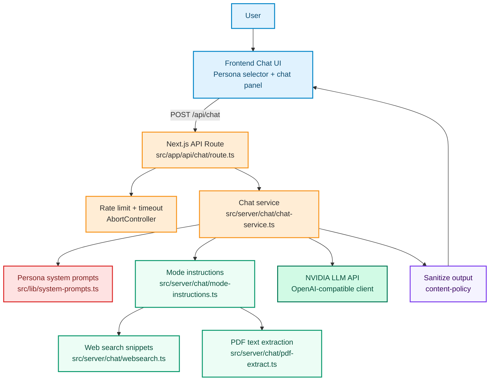
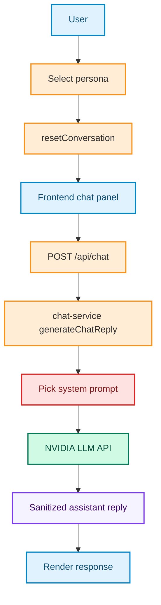

# PersonaAI

PersonaAI is a persona-based AI chatbot built for Scaler Academy and InterviewBit-style mentorship. The app provides real, conversational responses using distinct system prompts for three personas:

- Anshuman Singh
- Abhimanyu Saxena
- Kshitij Mishra

It also supports multiple interaction modes (default chat, thinking, websearch, canvas) and multimodal inputs (image and PDF).

## Live Demo

- **Deployed URL:** [personaaimentor.vercel.app](https://personaaimentor.vercel.app)
- **Local dev (Next.js default):** `http://localhost:3000`

## Features

- Clean chat UI with a persona selector
- Switching personas resets the conversation and context
- Persona-specific suggestion chips (quick-start prompts)
- Typing indicator while the backend is generating a reply
- Mobile responsive layout
- Backend prompt wiring with persona-specific system prompts
- Graceful API error handling
- Safety hardening:
  - rate limiting for `POST /api/chat`
  - strict request timeouts and abort handling for LLM, web lookup, and PDF extraction

## Architecture (Mermaid)

## Persona switch flow (Mermaid)

## Setup

1. Clone the repo:
   - `git clone https://github.com/alienx5499/PersonaAI`
2. Go to the project folder:
   - `cd PersonaAI`
3. Install dependencies:
   - `pnpm install`
4. Configure environment:
   - Copy `./.env.example` to `./.env`
   - Set `NVIDIA_API_KEY` in `./.env` (never commit real keys)
5. Run locally:
   - `pnpm dev`
   - Open `http://localhost:3000`

## Screenshots

| #   | Screen                                            | Image                                                                                                                                          |
| --- | ------------------------------------------------- | ---------------------------------------------------------------------------------------------------------------------------------------------- |
| 1   | Persona selector + active state                   |  |
| 2   | Chat panel with suggestions + attachment handling |        |
| 3   | Full-page app view                                |  |

## Repo Notes

- Persona system prompts live in [`src/lib/system-prompts.ts`](https://github.com/alienx5499/PersonaAI/blob/main/src/lib/system-prompts.ts)
- The chat API route is in [`src/app/api/chat/route.ts`](https://github.com/alienx5499/PersonaAI/blob/main/src/app/api/chat/route.ts)
- The server-side chat orchestration is in [`src/server/chat/chat-service.ts`](https://github.com/alienx5499/PersonaAI/blob/main/src/server/chat/chat-service.ts)
- Multimodal mode helpers:
  - [`src/server/chat/websearch.ts`](https://github.com/alienx5499/PersonaAI/blob/main/src/server/chat/websearch.ts)
  - [`src/server/chat/pdf-extract.ts`](https://github.com/alienx5499/PersonaAI/blob/main/src/server/chat/pdf-extract.ts)
  - [`src/server/chat/mode-instructions.ts`](https://github.com/alienx5499/PersonaAI/blob/main/src/server/chat/mode-instructions.ts)
